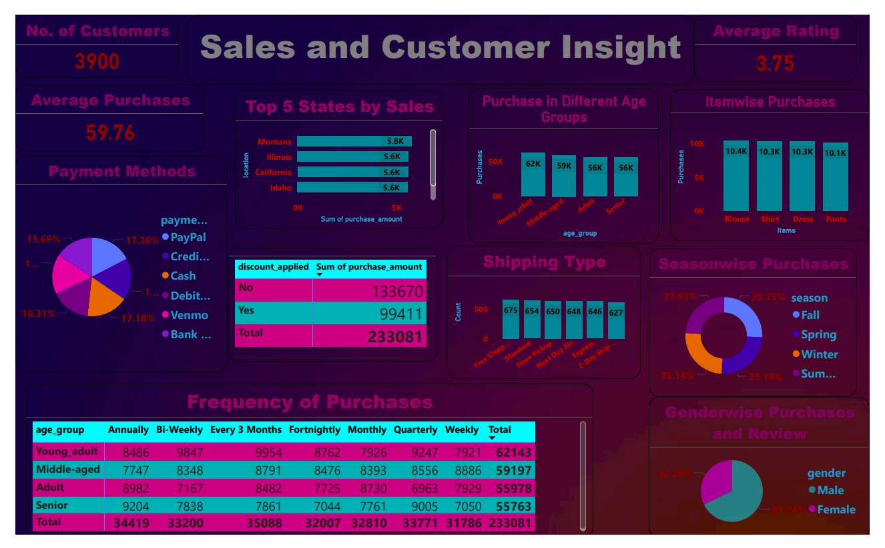

# 🛒 **Customer Shopping Behaviour Analysis**
## SQL | Python | Power BI
## 📑 Table of Contents
1. [Project Overview](#-project-overview)
1. [Objectives](#-objectives)
1. [Tools & Technologies Used](#-tools--technologies-used)
1. [Project Structure](#-project-structure)
1. [Data Cleaning & Preparation (Python)](#-data-cleaning--preparation-python)
1. [SQL Analysis](#️-sql-analysis)
1. [Power BI Dashboard](#-power-bi-dashboard)
1. [Key Insights](#-key-insights)
1. [What I Learned](#-what-i-learned)
1. [Future Improvements](#-future-improvements)
1. [About Me](#️-about-me)
1. [Author](#-author)


## 📌 Project Overview
This project focuses on analyzing customer **shopping behaviour** to understand  
purchasing patterns,spending trends, and customer segmentation.  
The main goal of this project is to use **data analysis and visualization**    
techniques to extract meaningful business insights that can help improve  
decision-making.

This is an **end-to-end data analytics project**, starting from raw data exploration  
to dashboard creation.

## 🎯 Objectives
- Understand customer purchasing patterns

- Identify high-value customers

- Analyze spending behaviour across categories

- Generate insights using SQL & Python

- Visualize key KPIs using Power BI

## 🧰 Tools & Technologies Used
- **SQL** – Data querying, filtering, aggregations

- **Python** – Data cleaning, analysis, feature extraction
(Pandas, NumPy, Matplotlib / Seaborn)

- **Power BI** – Interactive dashboard & business insights

- **GitHub** – Version control & project documentation

## 📂 Project Structure

```TEXT
customer-shopping-behaviour-sql-python-powerbi/
│
├── data/
│   └── customer_shopping_data.csv
│
├── sql/
│   └── customer_analysis_queries.sql
│
├── python/
│   └── customer_analysis.ipynb
│
├── powerbi/
│   └── customer_shopping_dashboard.pbix
│
└── README.md
```
## 🧹 Data Cleaning & Preparation (Python)
- Handled missing values

- Converted data types where required

- Extracted useful features from raw columns

- Removed inconsistencies in categorical data

- Performed basic EDA to understand distributions

## 🗃️ SQL Analysis
Using SQL queries, I performed:

- Customer-wise purchase analysis

- Total and average spending per customer

- Category-wise sales analysis

- Identifying frequent and high-value customers

SQL helped in validating insights generated through Python analysis.

## 📊 Power BI Dashboard

The Power BI dashboard includes:

- Total Sales & Average Order Value

- Customer segmentation visuals

- Category-wise purchase distribution

-Trend analysis for better business understanding

- The dashboard is interactive and designed from a business perspective.

## 🔍 Key Insights
- Certain customer segments contribute significantly to overall revenue

- A small number of categories drive most of the sales

- Repeat customers show higher average spending

- Clear purchasing trends can be observed across different groups

## 🚀 What I Learned
- How to combine SQL + Python + BI tools in one project

- Real-world data cleaning challenges

- Translating raw data into business insights

- Building dashboards with a clear storytelling approach

## 📈 Future Improvements

- Add customer segmentation using clustering

- Perform time-based trend analysis

- Deploy dashboard using Power BI Service

- Add more advanced SQL queries

## 🙋‍♂️ About Me
I am actively exploring the Data Analytics & Data Science field, working on real-world  
datasets to strengthen my analytical thinking and technical skills.This project reflects  
my hands-on learning  approach and interest in solving business problems using data.

## 👤 Author
Sanjeet Jaiswal  
Data Analyst  
📧 Email: sanjeet221601@gmail.com  
linkedin: https://www.linkedin.com/in/sanjeetjaiswal/  
